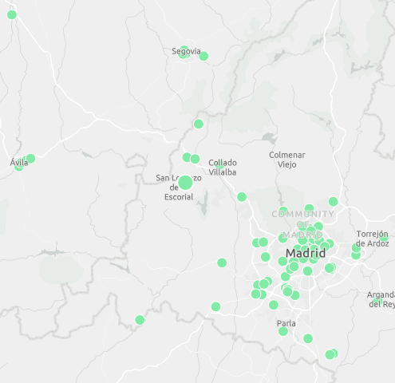
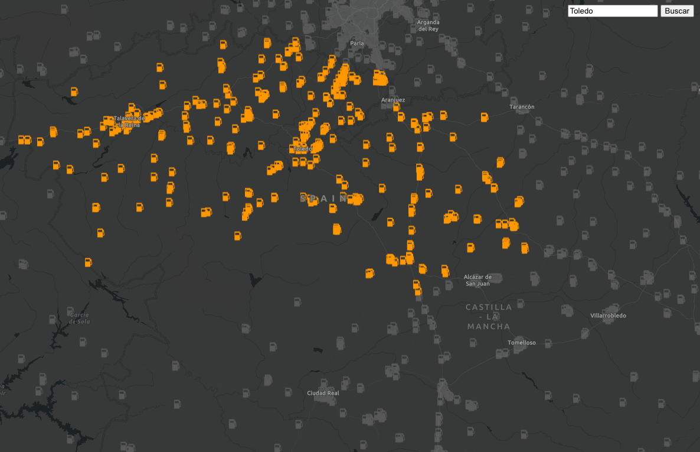
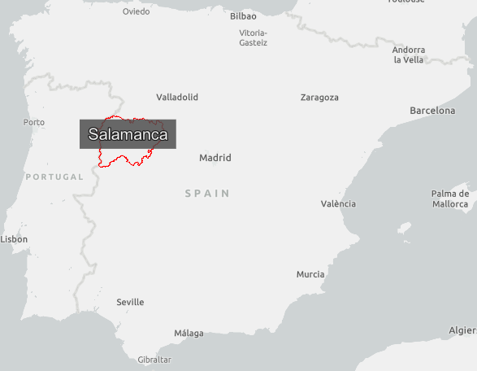
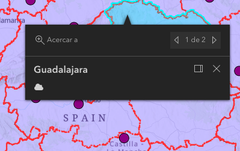

# Pruebas de funcionalidades de ArcGIS Maps SDK for JavaScript v4.x
Este repositorio agrupa pequeños proyectitos con los que testear la funcionalidad de la librería. 

1. Cambio de puntero y de tamaño del icono para destacar una feature

2. Efecto sobre features al aplicar un filtro por atributos

3. Mostrar etiqueta sobre un polígono al pasar el cursor por encima

4. Diferente contenido en popups
